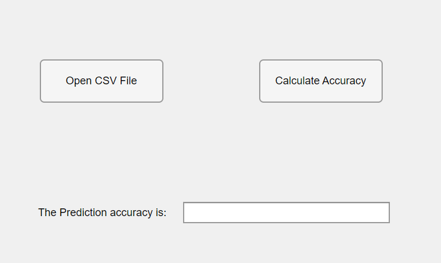

# Dog-Cardiomegaly
# SCTL

This directory contains the datasets for paper [Regressive Vision Transformer for Dog Cardiomegaly Assessment](https://www.nature.com/articles/s41598-023-50063-x), which is accepted by Scientific Reports.


If you have any questions, please email to yz945@cornell.edu
### Reference

If you find it is helpful, please cite it as:

`
Li, Jialu, and Youshan Zhang. "Regressive vision transformer for dog cardiomegaly assessment." Scientific Reports 14, no. 1 (2024): 1539.
`


Or in bibtex style:

```

@article{li2024regressive,
  title={Regressive vision transformer for dog cardiomegaly assessment},
  author={Li, Jialu and Zhang, Youshan},
  journal={Scientific Reports},
  volume={14},
  number={1},
  pages={1539},
  year={2024},
  publisher={Nature Publishing Group UK London}
}

```


<p align="center">
   
</p>
<p align="center">Dog Cardiomegaly Assessment Accuracy</p>


### Usage
1. [Download the labeled training, validation, and unlabeled test dataset here.](https://yuad-my.sharepoint.com/:f:/g/personal/youshan_zhang_yu_edu/EvaDmH5ZgsJBv8PCIP8cCwoBFl8ujWRMu_r8fjGeJkoYRg?e=1KJZrx) 
2. Train the model with the labeled training dataset and validation dataset
3. Evaluate the test dataset using the software

### Evluation
To avoid tuning the model based on the test dataset, we also provide an application to automatically evaluate the performance of your prediction.

1. You need to generate your prediction as a CSV file: [image_name, predicted labels]. We also uploaded a sample_results.csv for your reference.
2. For Windows user, install Dog_X_ray_classfication_accuracy.exe. You may need to install Matlab R2021b (9.11) MCR [here](https://www.mathworks.com/products/compiler/matlab-runtime.html) (Windows version).

   For Mac user, unzip Dog_X_ray_classfication_accuracy.zip and then install Dog_X_ray_classfication_accuracy.app. You may need to install R2022a (9.12) MCR [here](https://www.mathworks.com/products/compiler/matlab-runtime.html) (Mac version). 


<p align="center">
   
</p>
<p align="center">Dog Cardiomegaly Assessment Accuracy software</p>

4. Run Cow_teat_classfication_accuracy software to get your prediction accuracy

   I) Click on 'Open CSV File' 
   
   II) Click on 'Calculate Accuracy'
   
   III) You will see the accuracy in the text area


<p align="center">Sample evluation process using Dog_X_ray_classfication_accuracy software </p>


